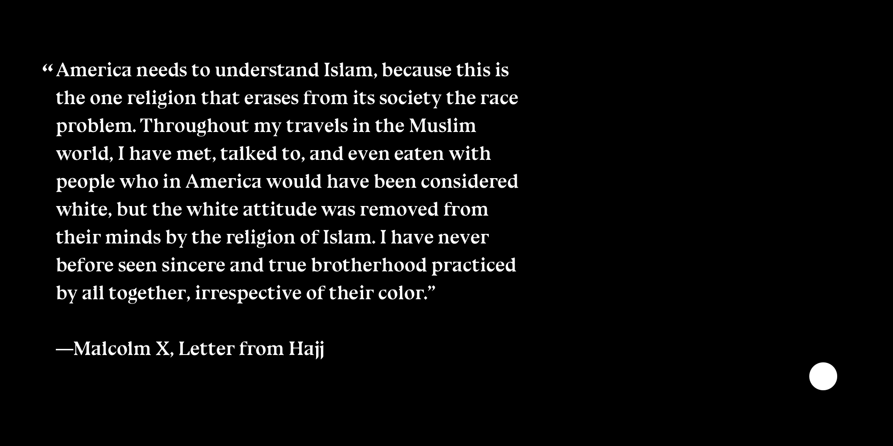

# Blue Ocean
🚧 Note: This is a work in progress and not yet ready for serious use.

A variable font fork of Bluu Next by Jean-Baptiste Morizot, redrawn in quadratic curves by Eli Heuer.
* https://velvetyne.fr/fonts/bluu/
* https://github.com/jbmorizot/BluuNext
* https://github.com/velvetyne/BluuNext

## DrawBot Example Images
Source: [documentation/drawbot/quote-001.py](documentation/drawbot/quote-001.py)

