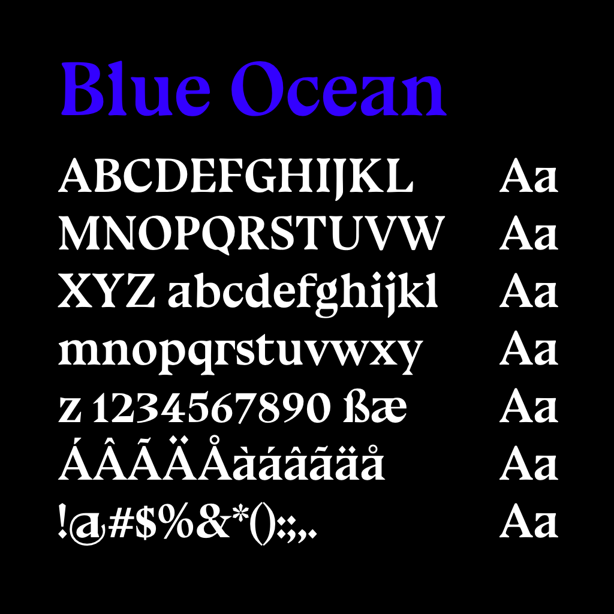
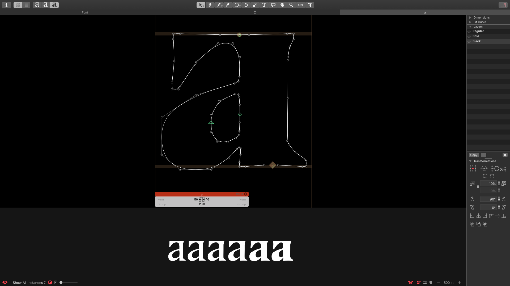
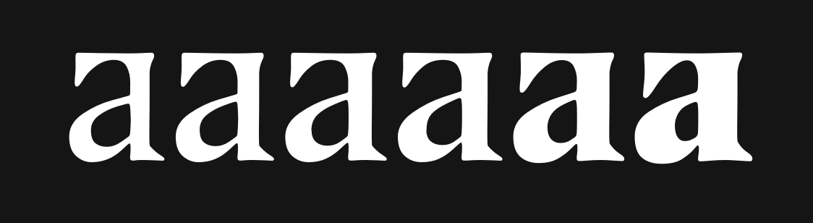

# Blue Ocean
A fork of VTF [Bluu Next](https://velvetyne.fr/fonts/bluu/) by [Jean-Baptiste Morizot](https://github.com/jbmorizot/BluuNext), redrawn in quadratic curves—and as a variable font—by Eli Heuer. This repository conforms to the [Google Font Spec](https://github.com/googlefonts/gf-docs/tree/master/Spec).

