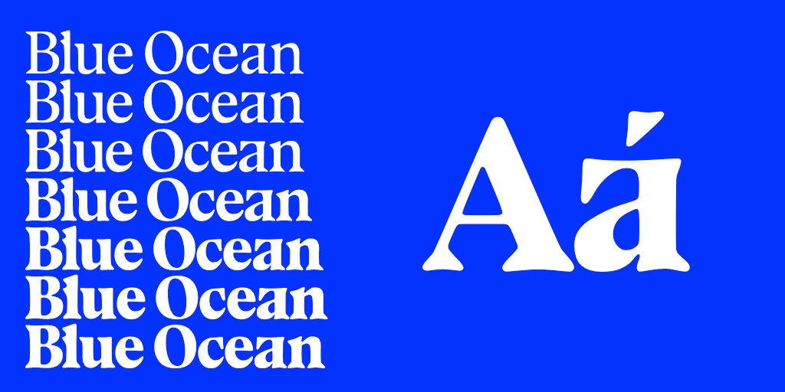

# Blue Ocean
Blue Ocean is a typeface([variable font](https://en.wikipedia.org/wiki/Variable_fonts)) originally forked from VTF [Bluu Next](https://velvetyne.fr/fonts/bluu/) by [Jean-Baptiste Morizot](https://github.com/jbmorizot/BluuNext), but with an expanded weight range redrawn in [TrueType](https://en.wikipedia.org/wiki/TrueType#Outlines) quadratic curves by Eli Heuer. The quadratic curve drawing style gives the font a [phototype-like](https://en.wikipedia.org/wiki/Phototypesetting) quality, and the outline structure allows for interpolation between a wider range of forms. This repository conforms to the [Google Fonts Spec](https://github.com/googlefonts/gf-docs/tree/master/Spec), supports the [Google Fonts Latin Core](CHARACTER_SET.txt) character set, and has adopted the [Rust Code of Conduct](https://www.rust-lang.org/policies/code-of-conduct).

A proprietary fork of Bluu Next was released as [Bluu Suuperstar](https://black-foundry.com/fonts/bluu-suuperstar) by [Black Foundry](https://black-foundry.com), if you want a version of this typeface with a more traditional outline style and better spacing, please buy a license for the commercial version here: https://black-foundry.com/fonts/bluu-suuperstar

Blue Ocean is licensed under the [SIL Open Font License](OFL.txt), please see the [OFL-FAQ.txt](OFL-FAQ.txt) file if you have any legal questions.

[Pull requests](https://github.com/eliheuer/blue-ocean/pulls) and new [issues](https://github.com/eliheuer/blue-ocean/issues) are welcome.



## Development

Build scripts and source files are in the [sources](sources) directory.

To build new fonts, open a Unix-like terminal (Linux, MacOS, WSL) in the [sources](sources) directory, and run the build script. If you have [Python3](https://www.python.org/) installed, this script should set up a temporary virtual environment and install all needed dependencies automatically.
```
sh build.sh
```
If you are making a pull request to Google Fonts, add the `-gf` flag and files will be moved to `~/Google/fonts/ofl/..` after building.
```
sh build.sh -gf
```
